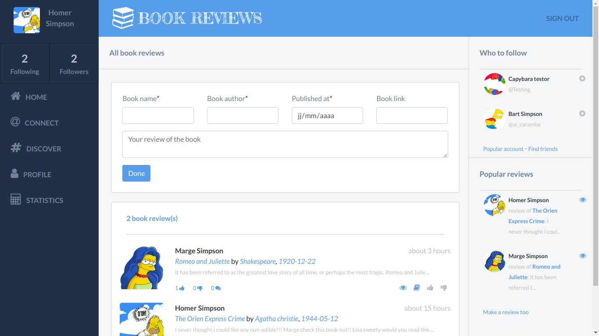
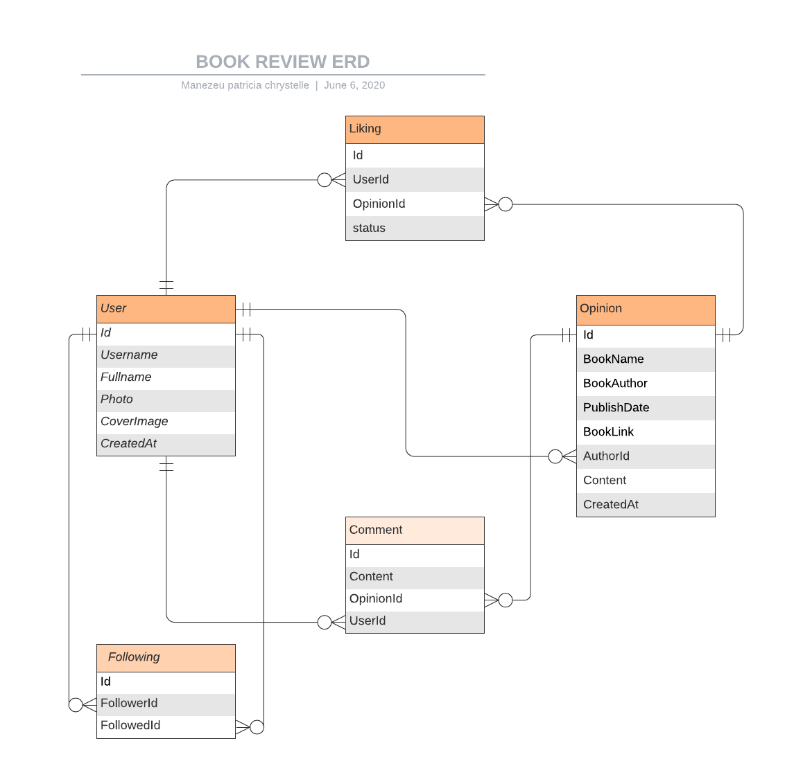

# Book review social media

> This is a social media web app for book lovers. It is always good to interact with people who share the same hobbies with you. Most important it is better to have some reviews about things before buying or viewing them, especially for book. 'Book Review' aims to connect books lovers and help them share their experiences about the books they have read before.



> The actions the any user could do in the app are
    - preview all book reviews and trending ones
    - Register
    - Sign in
    - Post a book review
    - Follow some interesting book reviewers
    - Like/dislike a book review
    - Comment a book review

> Thechnically speaking, the database schema is quite simple, made up with Lucidchart and goes like this: (You can get the file [here](https://github.com/patriciachrysy/rails-capstone-project/tree/feature/docs) )



## Built With

> The project was built using these technologies
    - Ruby v2.7.0
    - Ruby on Rails v6.0.3

## Live Demo


> Try out the app here: [book_review]()


## Getting Started

To get a local copy up and running follow these simple example steps.

- Clone the repository and there you go! ;-)

### Prerequisites

Ruby: 2.7
Rails: 6.0.3
Postgres: >=9.5

### Setup

- cd into the folder
- install the the bundles with the `bundle` or `bundle install` command. If you are asked to do `bundle update` before, do it.
- Set up the database using `rake db:migrate` or `rails db:migrate`

### Install

- Install VSCode or any code editor you like
- Install Ruby on rails 5.1.6 or later if you don't have it yet
- Run this command on your terminal in order to install rubocop: gem install rubocop 


### Usage

Start server with:

```
    rails server
```

Open `http://localhost:3000/` in your browser.

### Run tests

```
    rpsec --format documentation
```

### Deployment

> Follow the [Heroku deployment doc](https://devcenter.heroku.com/articles/getting-started-with-rails5) to deploy th app on heroku

## Special Credit

> Original site design by Gregoire Vella on Behance [Check it!](https://www.behance.net/gallery/14286087/Twitter-Redesign-of-UI-details)

## Authors


👤 **Manezeu Patricia Chrystelle**
- Github: [@githubhandle](https://github.com/patriciachrysy)
- Twitter: [@twitterhandle](https://twitter.com/ManezeuP)
- Linkedin: [linkedin](https://www.linkedin.com/in/manezeu-patricia-chrystelle-095072118/)


## 🤝 Contributing

Contributions, issues and feature requests are welcome!

Feel free to check the [issues page](https://github.com/patriciachrysy/rails-capstone-project/issues).

## Show your support

Give a ⭐️ if you like this project!

